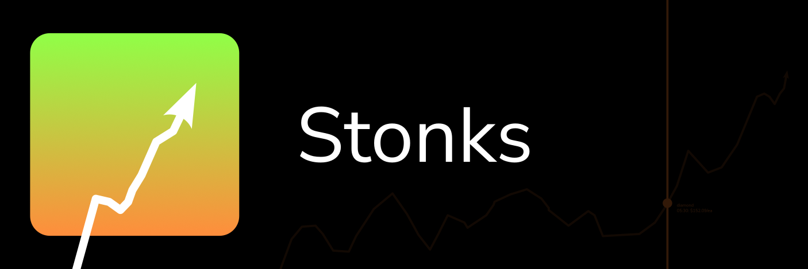

# Stonks

Weird little stocks/items market for block game.

## Get Stonks (for Fabric)
### Releases
All releases can be found in [Releases page](https://github.com/nahkd123/stonks/releases).

### Development builds
You can grab development builds [here](https://github.com/nahkd123/stonks/actions/workflows/gradle.yml?query=branch:main/1.20.x+is:success). Click on latest workflow run, scroll down to Artifacts section and click on ``Fabric Artifacts`` to download. Then copy ``stonks-fabric-[MOD VERSION]+[GAME VERSION].jar`` to your ``mods/`` folder/directory.

> **Small note**: The link about includes filter for success development builds only. Click on "Actions" tab to see everything.

## Documentations
For documentations, please [see here](https://nahkd123.github.io/stonks/).

## Contributing
All contributions are welcomed! This includes code, documentations, finding bugs and even helping other people using Stonks! 

Please take a look at [Code of Conduct](./CODE_OF_CONDUCT.md) before contributing to this project.

> **tl;dr**: be nice in general.

After that, see [Contributing guide](./CONTRIBUTING.md) to get started.

## Wait... why 2.0.0?
Most people doesn't know this, but Stonks was originally created as a [Bukkit plugin](https://github.com/MangoPlex/stonks). It was created to showcase what FeatherPowder's capability, but ended up abandoning it because the code base is too hard to maintain.

The first [Stonks for Fabric](https://github.com/phomc/stonks) port (let's call this "Stonks 1.1") was released under PhoMC organization. This one includes MongoDB support, but then I realized SQL databases are the better candidate for storing players' offer data.

And now we have Stonks 2.0! I decided to go for "local first" - storing all data locally before adding SQL support to the mod/plugin. I also decided to separate the market logic (``core`` subproject) and mod + plugin front-end (``fabric`` and ``bukkit`` subprojects) so other people can use Stonks Core for their "virtual market", like stocks market training platform for example, while keeping "Stonks for Fabric" and "Stonks for Bukkit".
