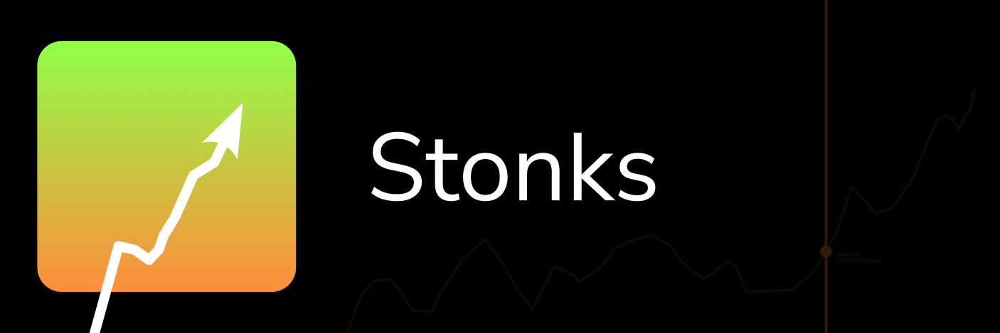

# Stonks _Next_

Weird little stocks/items market for block game.

Welcome to `next/snapshot` branch! This development branch currently contains the next major version of Stonks, which will be called "Stonks v3" once it reaches GA (General Availability). And because this is for the next major version, every single API will be changed.

Here are quick list of changes (so far!):

- Rewrite market service interface.
- New SQL market service (support any SQL with JDBC implementation).
- New remote market service for multi-instance setup.
- Deprecating `double` for currency in favor of `long` for accuracy.
- Standalone server and command-line interface.

The following tasks need to be finished:

- Converter to migrate from old config format to new JSON-based config.
- Auto-migrate database based on user's configuration file (applicable to local service only).
- _TODO_

Future tasks for distant future:

- Support for Paper-based servers.
- Standalone command-line interface for interacting market service server.

## Get Stonks (for Fabric)
> [!NOTE]
> Stonks _Next_ is currently unavailable for download at this moment. Below is the guide on getting Stonks v2.

### Releases
All releases can be found in [Releases page](https://github.com/nahkd123/stonks/releases).

### Development builds
You can grab development builds [here](https://github.com/nahkd123/stonks/actions/workflows/gradle.yml?query=branch:main/1.21.x+is:success). Click on latest workflow run, scroll down to Artifacts section and click on ``Fabric Artifacts`` to download. Then copy ``stonks-fabric-[MOD VERSION]+[GAME VERSION].jar`` to your ``mods/`` folder/directory.

> **Small note**: The link above includes filter for success development builds only. Click on "Actions" tab to see everything.

## Documentations
For documentations, please [see here](https://nahkd123.github.io/stonks/). Documentations are maintained in `docs/<version>` branches.

## Contributing
All contributions are welcomed! This includes code, documentations, finding bugs and even helping other people using Stonks! 

Please take a look at [Code of Conduct](./CODE_OF_CONDUCT.md) before contributing to this project.

> **tl;dr**: be nice in general.

After that, see [Contributing guide](./CONTRIBUTING.md) to get started.

## License
MIT License.
