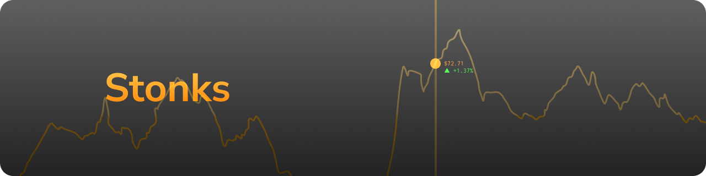

# Stonks

Weird little stocks/items market for block game.

## Get Stonks (for Fabric)
### Development builds
You can grab development builds from [Actions](https://github.com/nahkd123/stonks/actions?query=is:success) tab in this repository. Click on latest workflow run, scroll down to Artifacts section and click on ``Fabric Artifacts`` to download. Then copy ``stonks-fabric-[MOD VERSION]+[GAME VERSION].jar`` to your ``mods/`` folder/directory.

### Releases
No releases have been rolled out so far, but if there is a release, you can check out [Releases page](https://github.com/nahkd123/stonks/releases).

## Documentations
- [Wiki](https://github.com/nahkd123/stonks/wiki)
- [Developer's documentations](https://github.com/nahkd123/stonks/tree/main/1.20.x/docs)
